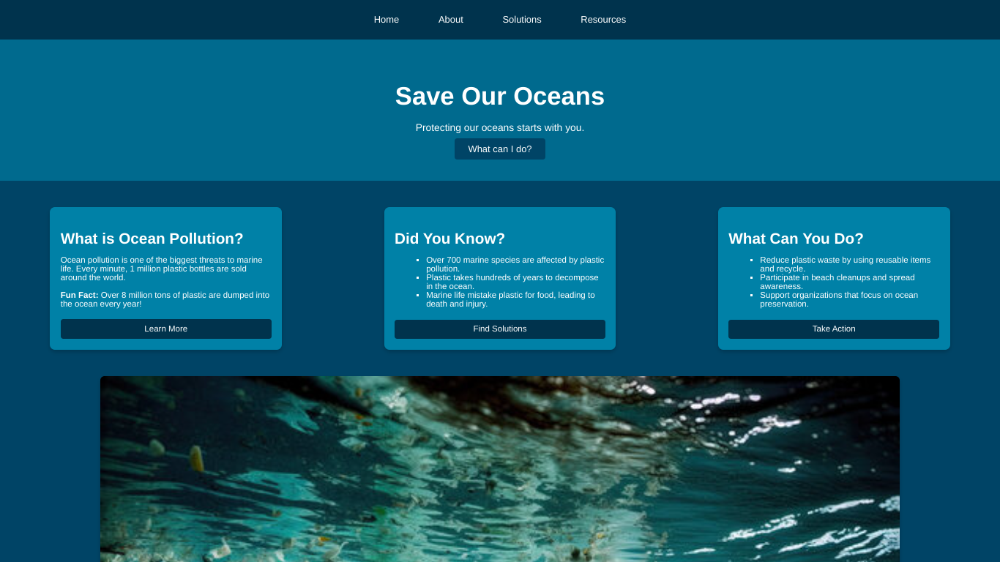

# 🌊 Ocean Protection Website  

This project was created for a **hackathon** to raise awareness about **ocean pollution** and ways to protect marine life. It is a **simple yet visually appealing website** that only uses **basic HTML and CSS**!  

## 🔹 About  
- 🌎 Focuses on **ocean conservation** and **pollution solutions**  
- 🎨 **Cool ocean-themed design** with basic HTML & CSS  
- 📄 Multi-page structure: **Home, About, Solutions, Resources**  
- 🖼️ Includes images to enhance the message